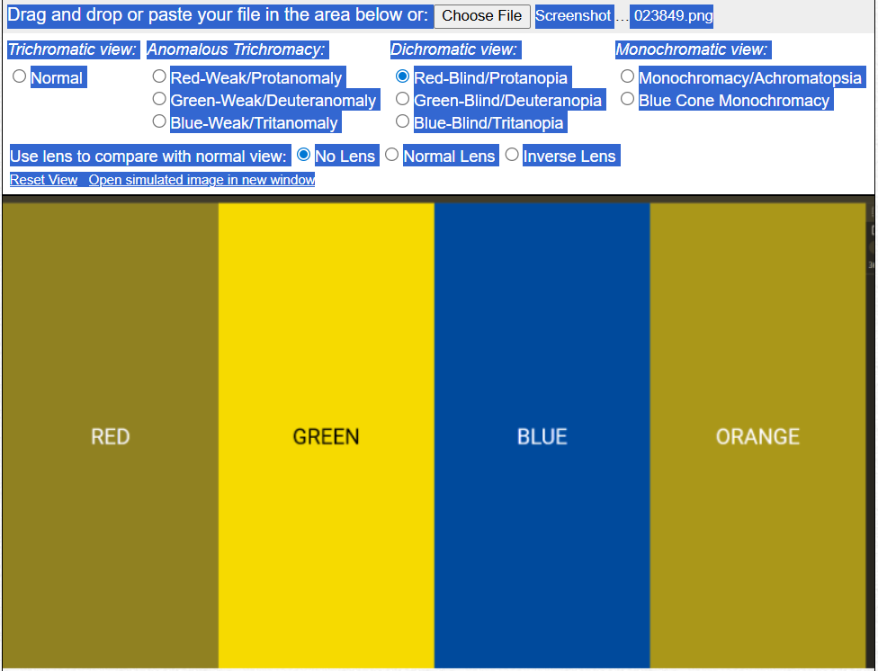
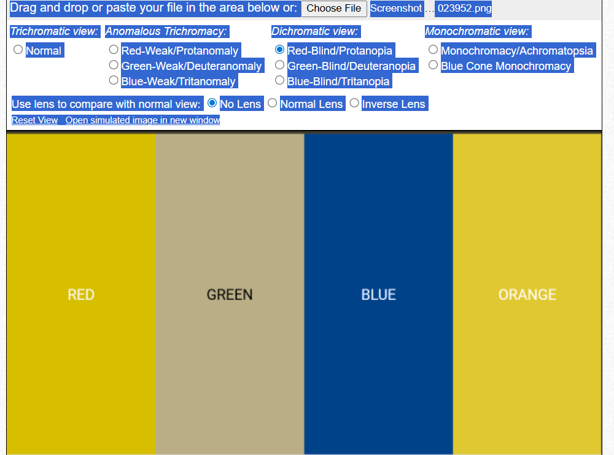
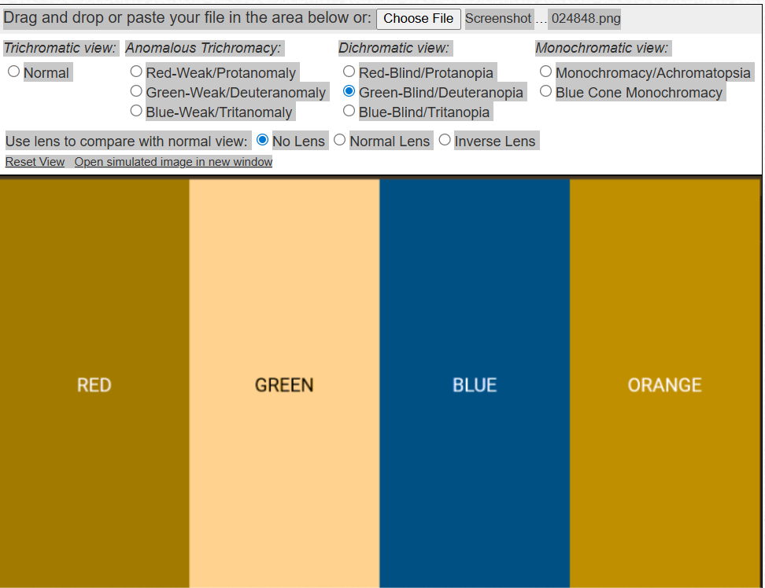
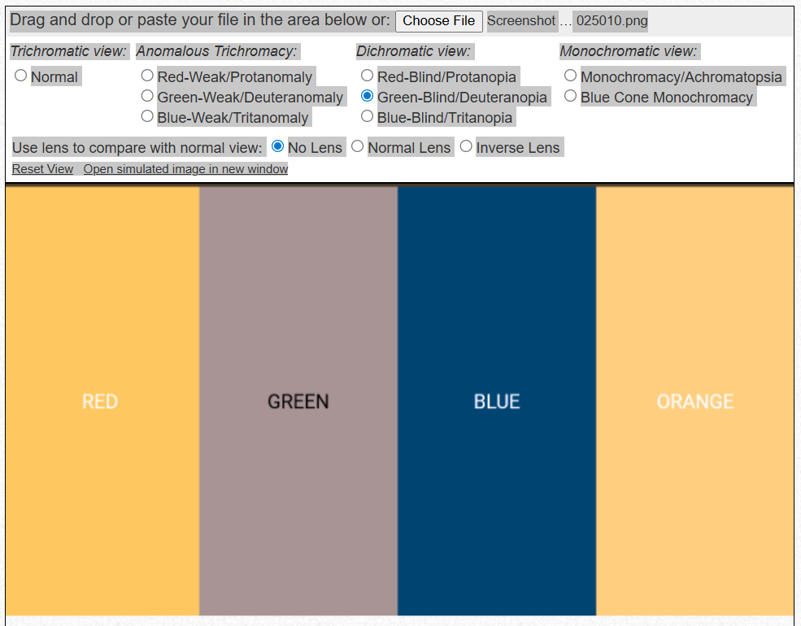

# Daltonify

A Chrome extension that applies real-time color correction filters for users with Protanopia (red-blind) and Deuteranopia (green-blind) color vision deficiency — on any website, without page reload.

## The Problem

~8% of males and ~0.5% of females have some form of red-green color blindness. Most websites are built without them in mind — red error messages, green success indicators, and color-coded UI elements become indistinguishable noise.

## What Daltonify Does

Daltonify injects SVG `feColorMatrix` filters into the browser's rendering pipeline to remap color channels for affected users. The goal is to shift confusion zones — colors that look identical to colorblind eyes — into more distinguishable hues.

> **Note:** These are custom correction matrices, not clinically validated. Effect was tested using the [Coblis Color Blindness Simulator](https://www.color-blindness.com/coblis-color-blindness-simulator/) and shows measurable improvement in color channel distinguishability.

## Observed Results (via Coblis Simulator)

### Protanopia (Red-Blind)

**Without Daltonify** — GREEN blends into beige, indistinguishable from RED



**With Daltonify** — GREEN shifts to bright yellow, clearly distinct from RED



---

### Deuteranopia (Green-Blind)

**Without Daltonify** — GREEN lost in peach tone, blends with ORANGE



**With Daltonify** — GREEN shifts to grey/mauve, clearly separable from RED and ORANGE



---

## Features

- Real-time color correction via SVG feColorMatrix filters — no page reload needed
- Three modes: Protanopia, Deuteranopia, Both
- Intensity slider (25% to 100%)
- MutationObserver support for SPAs and dynamically loaded content
- Settings persisted via `chrome.storage.local`
- Works cross-site — tested on Netflix, Google Maps, GitHub

## Installation (Developer Mode)

1. Clone this repo
   ```bash
   git clone https://github.com/trishh52/daltonify.git
   ```
2. Open Chrome → go to `chrome://extensions`
3. Enable **Developer mode** (top right)
4. Click **Load unpacked** → select the `daltonify` folder
5. Pin the extension and toggle it ON

## Tech Stack

- Manifest V3
- SVG feColorMatrix filters
- Chrome Extensions API (`storage`, `scripting`, `tabs`)
- Vanilla JS — no dependencies

## File Structure

```
daltonify/
├── manifest.json       # Chrome Extension Manifest V3
├── content.js          # DOM injection + filter logic + MutationObserver
├── popup.html          # Extension UI
├── popup.js            # Settings persistence + messaging
├── styles.css          # Popup styling
└── icons/
    └── icon128.png
```

## How It Works

1. On page load, `content.js` reads saved settings from `chrome.storage.local`
2. An SVG element with `feColorMatrix` filter definitions is injected into the DOM
3. The filter is applied to `document.documentElement` — affecting the entire page
4. A `MutationObserver` watches for dynamically loaded content (React, infinite scroll)
5. The popup communicates mode/intensity changes via `chrome.runtime.sendMessage`

